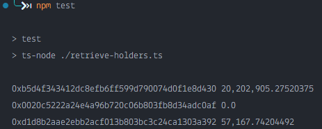

# Problem 4 Remarks

## Method

1. Used ethers.js to create a Contract with the given address.
2. Acquire the decimal and balance data with the `decimals` and `balanceOf` functions.
3. Convert the above into a string with the `formatUnits` function.
4. Finally, add commas with the `addCommas` function and print.

The result is shown below.

