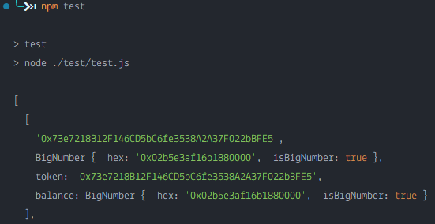

# Problem 5 Remarks

## Method

### Contract

1. We first  included a partial ERC20 interface with the `balanceOf` function in for later use.
2. Next we create a struct `TokenBalance` that includes the address and balance to return the required data as specified by the problem.
3. We then write the main contract and `getBalances` function
   * The function loops through the tokens and uses the `balanceOf` function through the interface to get the token balance.
   * It then creates and returns a `TokenBalance` with the address and balance.

### Deployment and Testing

1. Made use of Hardhat and ethers to deploy the contract onto the Goerli testnet
2. Chose a random person's wallet and ran the provided `test.js` script. The result is shown below.

