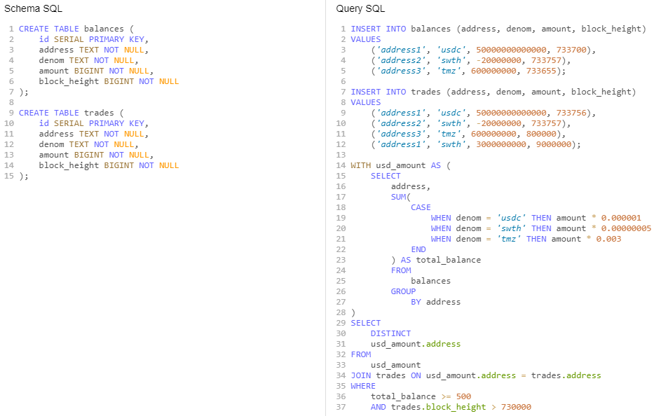

# Prolem 7 Remarks

## Method

1. First we create an auxillary table `usd_amount` where for a given address, the balance of each `denom` under the address is summed and converted into usd as `total_balance`.
2. Join the `usd_amount` and `trades` tables where the addresses match. This intermediate table can be seen as a trades table with an added total_balance column which allows us to perform a selection with the 2 conditions.
3. We then select addresses from rows where `total_balance >= 500` and `trades.block_height > 730000`
4. The `DISTINCT` keyword is used to prevent duplicates

## Testing

Used DB Fiddle to create mock tables and data to test the query.

Click [here](https://www.db-fiddle.com/f/4jyoMCicNSZpjMt4jFYoz5/7063 "Problem 7") to view it.

